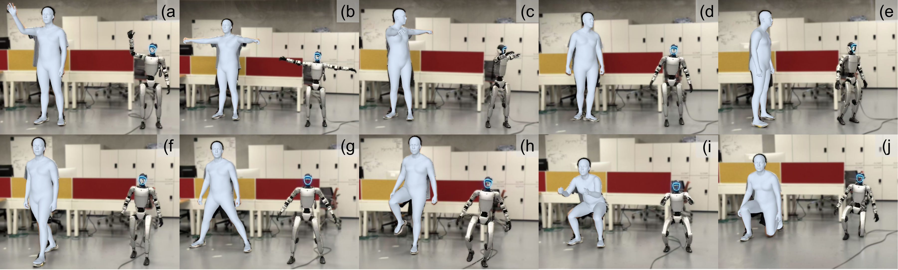
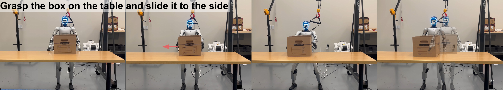
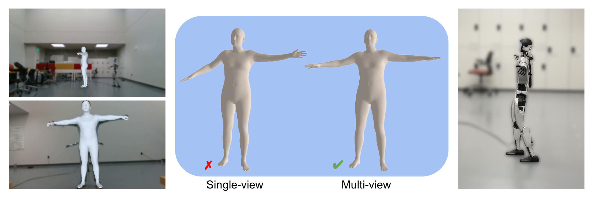

# Fast SAM 3D Body

### Accelerating SAM 3D Body for Real-Time Full-Body Human Mesh Recovery

[Timing Yang](http://yangtiming.github.io)<sup>1</sup>, [Sicheng He](https://hesicheng.net)<sup>1</sup>, [Hongyi Jing](https://hongyijing.me)<sup>1</sup>, [Jiawei Yang](https://jiawei-yang.github.io)<sup>1</sup>, [Zhijian Liu](https://zhijianliu.com)<sup>2,3</sup>, [Chuhang Zou](https://zouchuhang.github.io)<sup>4</sup><sup>†</sup>, [Yue Wang](https://yuewang.xyz)<sup>1,3</sup><sup>†</sup>

<sup>1</sup>USC Physical Superintelligence (PSI) Lab &nbsp; <sup>2</sup>University of California, San Diego &nbsp; <sup>3</sup>NVIDIA &nbsp; <sup>4</sup>Meta Reality Labs

<sup>†</sup> Joint corresponding authors

<p align="center">
  <a href="https://arxiv.org/abs/xxxx.xxxxx">
    
  </a>
  &nbsp;
  <a href="https://yangtiming.github.io/Fast-SAM-3D-Body-Page/">
    
  </a>
</p>

<p align="center">
  
</p>

> **Speed-accuracy overview of Fast SAM 3D Body.** Top left: Qualitative results on in-the-wild images show our framework preserves high-fidelity reconstruction. Top right: Our method achieves up to a **10.25x** end-to-end speedup over SAM 3D Body and replaces the iterative MHR-to-SMPL bottleneck with a **10,000x** faster neural mapping. Bottom: Our system enables real-time humanoid robot control from a single RGB stream at **~65 ms** per frame on an NVIDIA RTX 5090.

## Abstract

SAM 3D Body (3DB) achieves state-of-the-art accuracy in monocular 3D human mesh recovery, yet its inference latency of several seconds per image precludes real-time application. We present **Fast SAM 3D Body**, a training-free acceleration framework that reformulates the 3DB inference pathway to achieve interactive rates. By decoupling serial spatial dependencies and applying architecture-aware pruning, we enable parallelized multi-crop feature extraction and streamlined transformer decoding. Moreover, to extract the joint-level kinematics (SMPL) compatible with existing humanoid control and policy learning frameworks, we replace the iterative mesh fitting with a direct feedforward mapping, accelerating this specific conversion by over 10,000x. Overall, our framework delivers up to a **10.9x** end-to-end speedup while maintaining on-par reconstruction fidelity, even surpassing 3DB on benchmarks such as LSPET. We demonstrate its utility by deploying Fast SAM 3D Body in a vision-only teleoperation system that enables **real-time humanoid control** and the direct collection of manipulation policies from a single RGB stream.

<p align="center">
  
</p>

> **Qualitative comparison.** The original SAM 3D Body (left) and our Fast variant (right) yield visually comparable mesh reconstructions across diverse poses and multi-person scenes on 3DPW and EMDB.

## Getting Started

### Environment

Please refer to [SAM 3D Body](https://github.com/facebookresearch/sam-3d-body) for environment setup, or use our conda environment:

```bash
conda env create -f environment.yaml
conda activate fast_sam_3d_body
```

### Checkpoints

```
checkpoints/
├── sam-3d-body-dinov3/       # Auto-downloaded from HuggingFace on first run
│   ├── model.ckpt
│   └── assets/
│       └── mhr_model.pt
├── yolo/                     # Place YOLO-Pose weights here
│   └── yolo11m-pose.pt
└── moge_trt/                 # Generated by build_tensorrt.sh (optional)
    └── moge_dinov2_encoder_fp16.engine
```

### Run

```bash
# Basic inference
python demo_human.py --image_path ./notebook/images/dancing.jpg

# Optimized (torch.compile + TensorRT)
bash run_demo.sh
```

### TensorRT Acceleration (Optional)

```bash
# Convert all models (YOLO-Pose + MoGe encoder + DINOv3 backbone)
bash build_tensorrt.sh

# Or convert individually
python convert_yolo_pose_trt.py --model yolo11m-pose.pt --imgsz 640 --half
python convert_moge_encoder_trt.py --all
python convert_backbone_tensorrt.py --all
```

All generated engines are stored under `./checkpoints/`.

## Real-World Deployment

For instructions on running the publisher, see [docs/realworld_deployment.md](docs/realworld_deployment.md).

We demonstrate a real-time, vision-only teleoperation system for the Unitree G1 humanoid robot using a single RGB camera, operating at ~65 ms end-to-end latency on an NVIDIA RTX 5090.

<p align="center">
  
</p>

> **Humanoid teleoperation.** The system tracks diverse whole-body motions including upper-body gestures (a), body rotations (b-e), walking (f), wide stance (g), single-leg standing (h), squatting (i), and kneeling (j).

<p align="center">
  
</p>

> **Humanoid policy rollout.** The robot grasps a box on the table with both hands, squats down, and steps to the right. Achieving 80% task success rate with 40 demonstrations collected via our system.

<p align="center">
  
</p>

> **Single-View vs Multi-View.** Multi-view fusion resolves depth ambiguities inherent in single-view reconstruction, producing more accurate SMPL body estimates.

## Citation

```bibtex
@inproceedings{fastsam3dbody2026,
  title={Fast SAM 3D Body: Accelerating SAM 3D Body for Real-Time Full-Body Human Mesh Recovery},
  author={Yang, Timing and He, Sicheng and Jing, Hongyi and Yang, Jiawei and Liu, Zhijian and Zou, Chuhang and Wang, Yue},
  year={2026}
}
```

## Acknowledgements

This project builds upon [SAM 3D Body](https://github.com/facebookresearch/sam-3d-body) (3DB) and [Multi-HMR (MHR)](https://github.com/facebookresearch/MHR). We thank the original authors for releasing their models and codebases, which served as the foundation for our acceleration framework.
