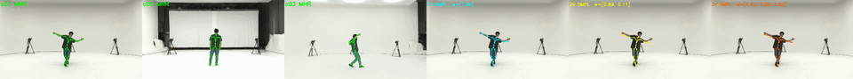

# MHR2SMPL: Multi-View Mesh-to-SMPL Parameter Inference

Convert MHR mesh predictions (from SAM-3D-Body / Stage 1) into SMPL body model parameters using a lightweight multi-view fusion network. Optionally apply a temporal SmootherMLP for joint denoising.

## Demo Results

### AIST++ (Multi-View Dance)



### Gym (Multi-View Lunge)


## Overview

**Pipeline:**
```
Stage 1 (SAM-3D-Body backbone)
  → MHR vertices [18439, 3] per camera view
  → Barycentric mapping → SMPL topology [6890, 3]        <0.1ms
  → Subsample 1500 verts + centroid-center → [4500]       <0.1ms
  → Multi-view fusion (MinimalMultiViewNet)                ~0.4ms
  → Output: global_orient[6D] + body_pose[63] + betas[10]
  → (Optional) SMPL FK → joints[24,3]                     ~2ms
  → (Optional) SmootherMLP temporal denoising
```

## Project Structure

```
mhr2smpl/
├── README.md
├── run_multiview_pipeline.sh        # Full pipeline script (Step 0→Demo)
│
├── data/                            # Data files & training pairs
│   ├── SMPL_NEUTRAL.pkl             # SMPL model (from smplx / MHR repo)
│   ├── mhr2smpl_mapping.npz         # Barycentric mapping MHR→SMPL
│   ├── smpl_vert_sample_indices.npy # 1500 vertex subsampling indices
│   ├── pairs_*.npz                  # Collected training pairs (generated by Step 1)
│   ├── mv_pairs_*.npz              # Multi-view training pairs (generated by Step 1b)
│   ├── pairs_all_merged.npz        # Merged training data (generated by Step 1c)
│   ├── outputs_EMDB/samples/       # Stage 1 inference outputs for EMDB
│   └── outputs_3dpw/samples/       # Stage 1 inference outputs for 3DPW
│
├── multi_view/                      # Core code
│   ├── multiview_net.py             # MinimalMultiViewNet definition
│   ├── infer_multiview.py           # MHR2SMPLMultiView inference interface
│   ├── step0_infer_EMDB.py          # Stage 1 inference: EMDB dataset
│   ├── step0_infer_3dpw.py          # Stage 1 inference: 3DPW dataset
│   ├── step0_infer_RICH.py          # Stage 1 inference: RICH dataset
│   ├── step1a_collect_fitted.py     # Collect training pairs (fitted SMPL supervision)
│   ├── step1b_collect_RICH.py       # Collect RICH multi-view pairs (GT SMPL)
│   ├── step1b_collect_AIST.py       # Collect AIST++ multi-view pairs (GT + real Stage1)
│   ├── step1c_merge.py              # Merge all datasets into one training file
│   ├── step2_train.py               # Multi-view network training
│   ├── step3_eval.py                # Evaluation (MPJPE / PA-MPJPE / PVE)
│   ├── step3_demo_RICH.py           # Full pipeline demo: RICH dataset
│   └── step3_demo_AIST.py           # Full pipeline demo: AIST++ dataset
│
├── smooth/                          # SmootherMLP (temporal joint denoising)
│   ├── smoother_net.py              # SmootherMLP network definition
│   ├── dataset.py                   # AMASS dataset loader
│   ├── preprocess_amass.py          # Preprocess AMASS → joint sequences
│   ├── train_smoother.py            # SmootherMLP training script
│   └── data/                        # AMASS preprocessed data (symlink)
│
├── experiments/                     # Trained checkpoints
│   ├── multiview_n30000_e500/       # Multi-view network experiment
│   │   ├── best_model.pth           # Best model weights
│   │   ├── config.json              # Training config & results
│   │   ├── sample_idx.npy           # Vertex subsampling indices (must match training)
│   │   ├── val_idx.npy              # Validation split indices
│   │   └── eval_RICH/               # Evaluation results
│   └── smoother_w5/                 # SmootherMLP checkpoint
│       ├── smoother_best.pth        # Best smoother weights
│       └── smoother_config.json     # Smoother config
│
├── output_visualization/            # Demo output videos & GIFs
│   ├── output_aist_gBR_sBM_cAll_d04_mBR0_ch01_c01c05c03.mp4
│   ├── output_aist_gBR_sBM_cAll_d04_mBR0_ch01_c01c05c03.gif
│   ├── output_Gym_010_lunge1_c01c04c05.mp4
│   └── output_Gym_010_lunge1_c01c04c05.gif
│
└── weights/                         # (Alternative weight location)
    └── best_model.pth               # Symlink or copy of best model
```

## Environment Setup

### 1. Conda Environment

The project uses the `fast_sam_3d_body` conda environment, which provides PyTorch with CUDA support and all required dependencies.

```bash
# Create and activate conda environment
conda create -n fast_sam_3d_body python=3.11
conda activate fast_sam_3d_body

# Install PyTorch (adjust CUDA version as needed)
pip install torch torchvision --index-url https://download.pytorch.org/whl/cu121

# Install dependencies
pip install smplx numpy scipy opencv-python tqdm
```

### 2. Pixi Environment (for Step 1a fitted data collection)

Step 1a (`step1a_collect_fitted.py`) uses the MHR conversion tools, which require the pixi environment from the original MHR repository. This step runs `convert_mhr2smpl` to generate fitted SMPL supervision.

```bash
# Install pixi (if not already installed)
curl -fsSL https://pixi.sh/install.sh | bash

# The pixi environment is defined in the MHR repository's pyproject.toml
# Step 1a is invoked via: pixi run --manifest-path <MHR_REPO>/pyproject.toml python step1a_collect_fitted.py
```

> **Note**: Steps 0, 1b, 2, 3, Smooth, and Demo all use the conda `fast_sam_3d_body` environment. Only Step 1a requires pixi.

## Required Data & Weights

### MHR Repository

Several required files come from the official MHR (Multi-HMR) repository. Clone it first:

```bash
git clone https://github.com/facebookresearch/MHR.git
cd MHR
```

> The barycentric mapping and SMPL model files are located under `tools/mhr_smpl_conversion/` in this repository. The pixi environment for Step 1a is also defined here.

### Files to download

| File | Location | Source | Description |
|------|----------|--------|-------------|
| `SMPL_NEUTRAL.pkl` | `data/` | [smplx](https://smpl-x.is.tue.mpg.de/) or [MHR](https://github.com/facebookresearch/MHR) repo | SMPL body model (neutral gender) |
| `mhr2smpl_mapping.npz` | `data/` | [MHR](https://github.com/facebookresearch/MHR): `tools/mhr_smpl_conversion/assets/mhr2smpl_mapping.npz` | Precomputed barycentric mapping (MHR 18439 verts → SMPL 6890 verts) |
| `smpl_vert_sample_indices.npy` | `data/` | Generated by Step 1a, or copy from experiment | 1500 vertex subsampling indices |
| `yolo11m-pose.engine` | `checkpoints/yolo/` | Ultralytics YOLO (TensorRT compiled) | Person detector for Stage 1 |
| `amass_joints.npz` | `smooth/data/` | Preprocessed from [AMASS](https://amass.is.tue.mpg.de/) via `preprocess_amass.py` | Joint sequences for SmootherMLP training |

### From the MHR repository

Clone [MHR](https://github.com/facebookresearch/MHR) and copy the required files:

```bash
git clone https://github.com/facebookresearch/MHR.git
MHR_REPO=./MHR

# Barycentric mapping (MHR mesh → SMPL topology)
cp ${MHR_REPO}/tools/mhr_smpl_conversion/assets/mhr2smpl_mapping.npz mhr2smpl/data/

# SMPL model (if you don't already have it)
cp ${MHR_REPO}/tools/mhr_smpl_conversion/data/SMPL_NEUTRAL.pkl mhr2smpl/data/
```

The mapping file contains:
- `mhr_vert_ids`: `[6890, 3]` — triangle vertex indices in MHR mesh for each SMPL vertex
- `baryc_coords`: `[6890, 3]` — barycentric interpolation weights

### Datasets (for training data collection)

| Dataset | Used in | Purpose |
|---------|---------|---------|
| [3DPW](https://virtualhumans.mpi-inf.mpg.de/3DPW/) | Step 0 + Step 1a | Single-view fitted supervision |
| [EMDB](https://eth-ait.github.io/emdb/) | Step 0 + Step 1a | Single-view fitted supervision |
| [RICH](https://rich.is.tue.mpg.de/) | Step 0 + Step 1b | Multi-view GT SMPL supervision |
| [AIST++](https://google.github.io/aistplusplus_dataset/) | Step 1b | Multi-view GT SMPL + real Stage 1 inference |
| [AMASS](https://amass.is.tue.mpg.de/) | Smooth | Motion sequences for SmootherMLP training |

## Training

### Quick Start (full pipeline)

```bash
cd /path/to/Fast_sam-3d-body
bash mhr2smpl/run_multiview_pipeline.sh 2>&1 | tee mhr2smpl/pipeline.log
```

The pipeline script has step control flags at the top — set `RUN_STEP0=1`, `RUN_STEP1=1`, etc. to enable/disable individual steps.

### Step-by-Step

#### Step 0: Stage 1 Inference (SAM-3D-Body)

Run SAM-3D-Body backbone on each dataset to produce MHR mesh predictions (`sample_*.npz`).

```bash
conda activate fast_sam_3d_body
cd /path/to/Fast_sam-3d-body

# EMDB
python mhr2smpl/multi_view/step0_infer_EMDB.py \
    --data_dir <EMDB_DATA_DIR> \
    --output_dir mhr2smpl/data/outputs_EMDB \
    --max_samples 30000

# 3DPW
python mhr2smpl/multi_view/step0_infer_3dpw.py \
    --data_dir <3DPW_DATA_DIR> \
    --output_dir mhr2smpl/data/outputs_3dpw \
    --split test --max_samples 30000
```

Each `sample_*.npz` contains: `pred_vertices [18439,3]`, `pred_cam_t [3]`, `pred_keypoints_3d`, and ground truth annotations.

#### Step 1a: Collect Fitted Pairs (3DPW + EMDB)

Runs `convert_mhr2smpl` optimization to get fitted SMPL parameters as supervision. **Requires pixi environment.**

```bash
cd <MHR_REPO>/tools/mhr_smpl_conversion
pixi run python <path_to>/step1a_collect_fitted.py \
    --input_dir mhr2smpl/data/outputs_EMDB/samples \
    --smpl_model ./data/SMPL_NEUTRAL.pkl \
    --output_path mhr2smpl/data/pairs_EMDB_fitted.npz \
    --max_samples 30000 --num_sampled_verts 1500 \
    --max_views 4 --use_fitted --no_viz
```

#### Step 1b: Collect Multi-View Pairs (RICH + AIST++)

RICH provides real multi-camera GT SMPL. AIST++ provides multi-view video with GT SMPL and runs real-time Stage 1 inference.

```bash
# RICH (requires pixi for barycentric mapping)
pixi run python step1b_collect_RICH.py \
    --input_dirs <RICH_SAMPLES> \
    --output_path mhr2smpl/data/mv_pairs_RICH.npz

# AIST++ (uses conda, runs real Stage 1 inference on video frames)
conda activate fast_sam_3d_body
python step1b_collect_AIST.py \
    --video_dir <AIST_VIDEO_DIR> \
    --aist_dir <AIST_DIR> \
    --output_path mhr2smpl/data/mv_pairs_AIST_stage1.npz \
    --frame_stride 18
```

#### Step 1c: Merge All Datasets

```bash
pixi run python step1c_merge.py \
    --inputs mhr2smpl/data/pairs_3dpw_fitted.npz \
             mhr2smpl/data/pairs_EMDB_fitted.npz \
             mhr2smpl/data/mv_pairs_RICH.npz \
             mhr2smpl/data/mv_pairs_AIST_stage1.npz \
    --output mhr2smpl/data/pairs_all_merged.npz
```

#### Step 2: Train Multi-View Network

```bash
conda activate fast_sam_3d_body
python mhr2smpl/multi_view/step2_train.py \
    --data_path mhr2smpl/data/pairs_all_merged.npz \
    --smpl_model mhr2smpl/data/SMPL_NEUTRAL.pkl \
    --save_dir mhr2smpl/experiments/multiview_n30000_e500 \
    --from_scratch \
    --epochs 500 --lr 1e-3 --batch_size 64 \
    --num_views_select 2 --sv_loss_weight 0.5
```

**Training details:**
- Architecture: `MinimalMultiViewNet` — shared encoder (4500→512→256), per-view confidence head, weighted fusion, decoder (256→79)
- Output: 6D global orient + 63D body pose (21 joints) + 10D shape betas = 79D
- Losses: vertex reconstruction (L1) + FK joint error (L1) + parameter MSE + confidence entropy regularization
- SV+MV dual loss: each view also gets a single-view loss (weighted by `--sv_loss_weight`)

#### Step 3: Evaluation

```bash
pixi run python step3_eval.py \
    --input_dirs <RICH_SAMPLES> \
    --model_dir mhr2smpl/experiments/multiview_n30000_e500 \
    --smpl_model ./data/SMPL_NEUTRAL.pkl \
    --output_dir mhr2smpl/experiments/multiview_n30000_e500/eval_RICH \
    --single_view_baseline
```

Metrics: MPJPE (mm), PA-MPJPE (mm), PVE (mm).

### SmootherMLP Training (Optional)

Trains a temporal MLP on AMASS motion data to denoise per-frame joint predictions.

```bash
# 1. Preprocess AMASS data
python mhr2smpl/smooth/preprocess_amass.py \
    --amass_dir <AMASS_DIR> \
    --output mhr2smpl/smooth/data/amass_joints.npz

# 2. Train SmootherMLP
python mhr2smpl/smooth/train_smoother.py \
    --data mhr2smpl/smooth/data/amass_joints.npz \
    --output_dir mhr2smpl/experiments/smoother_w5 \
    --window_size 5 --hidden_dims 512 256 \
    --noise_std 0.02 --epochs 100
```

## Inference API

```python
from mhr2smpl.multi_view.infer_multiview import MHR2SMPLMultiView

# Initialize (with optional SmootherMLP)
model = MHR2SMPLMultiView(
    model_path="mhr2smpl/experiments/multiview_n30000_e500/best_model.pth",
    smoother_dir="mhr2smpl/experiments/smoother_w5",  # optional
)

# Prepare views: list of (pred_vertices [18439,3], pred_cam_t [3])
views = [(pred_verts_cam1, cam_t_1), (pred_verts_cam2, cam_t_2)]

# Infer SMPL parameters
go, body_pose, betas, weights = model.infer(views)
# go: [3] global orient (axis-angle)
# body_pose: [63] body pose (21 joints × 3)
# betas: [10] shape coefficients
# weights: [V] per-view confidence

# Or with 3D joints (+ optional SmootherMLP denoising)
go, body_pose, betas, weights, joints = model.infer_smpl_joints(views)
# joints: [24, 3] root-relative canonical joints
```

## Key Design Details

### Vertex Subsampling Strategy

From 6890 SMPL vertices, 1500 are sampled as network input:
- **1200 uniform**: `np.linspace(0, 6889, 1200)`
- **300 ankle/foot dense**: vertices where LBS weight > 0.3 for joints 7, 8, 10, 11 (ankles and feet)
- Deduplicated to exactly 1500

> **Critical**: The same `sample_idx` must be used for both training and inference. The indices are saved in `experiments/<exp>/sample_idx.npy` and `data/smpl_vert_sample_indices.npy`.

### Preprocessing (per view)

1. YZ-flip: `verts[:, 1] *= -1; verts[:, 2] *= -1` (Stage 1 coordinate convention)
2. Camera translation: `verts_world = verts + cam_t`
3. Barycentric mapping: MHR [18439] → SMPL [6890] via precomputed face indices + weights
4. Subsample: SMPL [6890] → [1500] via `sample_idx`
5. Centroid-center and flatten → [4500] input vector
